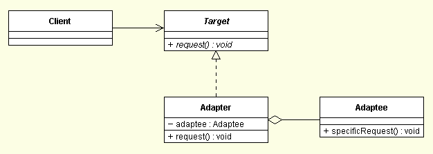
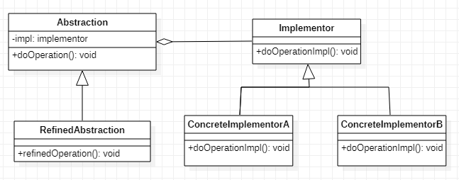
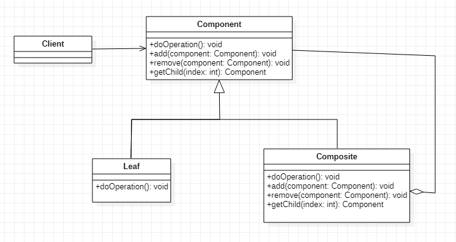
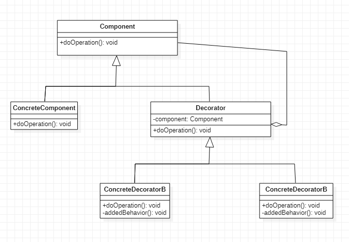
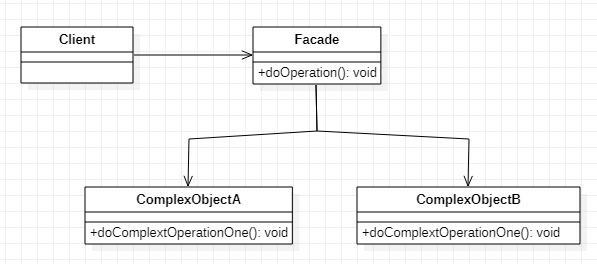
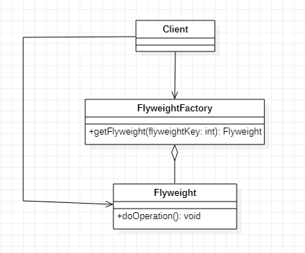

## 어댑터(Adapter)

1. 정의
   - 재사용하려는 클래스가 제공하는 인터페이스와 클라이언트가 사용하는 인터페이스가 다를 경우가 있는 데 어댑터 클래스를 이용하여 인터페이스를 일치시키는 패턴
2. 클래스 다이어그램
   - 
3. 구성요소
   - Target
     - 클라이언트에게 필요한 메서드(request())를 제공한다.
   - Client
     - Target에서 제공하는 메서드를 사용한다.
   - Adaptee
     - 클라이언트가 원하는 기능을 구현하는 메서드를 가지고 있다.
   - Adapter
     - Adaptee가 제공하는 메서드를 사용하고 Target 인터페이스를 구현한다.
4. 사용시점
   - 다른 개발자가 작성한 클래스를 재사용해야 한다.
   - 클라이언트가 요구하는 인터페이스와 재사용하려는 클래스의 인터페이스가 일치하지 않는다.
   - 애플리케이션에 필요한 기능을 이미 구현한 기존의 클래스가 있는데 수정이 불가능하거나 수정을 하였을 경우에 버그가 발생할 가능성이 높다.
5. 사용효과
   - 인터페이스가 호환되지 않아 쓸 수 없었던 클래스들을 사용할 수 있게 해 준다.
   - 기존 클래스가 제공하는 기능의 안전성을 그대로 유지할 수 있다.

## 브릿지(Bridge)

1. 정의
   - 추상적 개념과 구체적 구현 사이의 종속성을 제거하여 목적에 맞게 다양한 구현 방법을 사용하도록 제공하는 패턴
2. 클래스 다이어그램
   - 
3. 구성요소
   - Abstraction
     - Implementor 역할의 메서드를 사용해서 기본적인 기능만 기술되어 있는 클래스이다.
     - 이 인스턴스는 Implementor 역할을 가지고 있다.
     - 기본적인 기능만이 서술되어 있고 여기서 기술되어 있는 기능들이 바로 Bridge를 통해서 기능을 위임받은 클래스와 교감할 수 있다.
   - RefinedAbstraction
     - Abstraction 역할에다 기능을 추가한 역할
   - Implementor
     - Abstraction 역할의 인터페이스(API)를 구현하기 위한 메서드를 규정하는 역할이다.
     - 이런 기능의 구현을 위임 받은 클래스로서, Abstraction 클래스의 기능을 하위 클래스에서 구현하도록 인터페이스로 선언되어 있으며 Bridge의 역할을 담당한다.
   - ConcreteImplementor
     - Implementor 인터페이스를 구현한다.
4. 사용시점
   - 기본 기능과 확장 가능한 기능이 하나의 클래스에 혼재한다.
   - 하나는 미래에 변할 가능성이 별로 없고, 하나는 변할 가능성이 많을 때
5. 사용효과
   - 추상화된 부분과 실제 구현 부분을 독립적으로 확장 할 수 있다.
   - 추상적 개념과 구체적 구현 사이에 종속성이 제거되어 다양한 구현 방법을 사용할 수 있게 해준다.

## 컴포지트(Composite)

1. 정의
   - 부분-전체의 관계를 갖는 객체들을 동일한 방식으로 다루는 패턴
2. 클래스 다이어그램
   - 
3. 구성요소
   - Leaf
     - Component 인터페이스를 구현해야 한다.
     - 다른 요소를 가질 수 없다.
     - Component 인터페이스 중에 add(), remove(), getChild() 같은 메서드는 필요하지 않아도 상속받거나 구현해야 한다.
     - 자신에 대한 행동만 정의하면 된다.
     - Composite 객체의 부품으로 설정한다.
   - Composite
     - Coponent 인터페이스를 구현해야 한다.
     - Leaf나 Composite 같은 Component를 구현한 객체들을 추가할 수 있다.
     - Component 인터페이스 중에 Leaf와 관련있는 메서드를 필요하지 않아도 상속받거나 구현해야 한다.
     - 자식 구성요소와 관련된 기능 add(), remove(), getChild()를 구현해야 한다.
   - Component
     - Leaf와 Composite를 동일시하기 위한 공통 인터페이스를 제공한다.
     - 모든 구성요소들은 Leaf인지, Composite인지를 구별하지 않고 서로 교환해서 사용할 수 있다.
     - Composite뿐만 아니라 Leaf에 대한 메서드까지 정의한다.
   - Client
     - Component 인터페이스를 이용하여 복합 객체 내의 객체들을 조작할 수 있다.
4. 사용시점
   - 데이터 구조를 계층적으로 표현할 수 있다.
   - 객체들이 부분-전체의 관계를 갖는다.
5. 사용효과
   - 전체나 부분이냐에 상관없이 클라이언트는 단일 인터페이스로 기능을 실행할 수 있다.
   - 복합 객체와 개별 객체에 대해 똑같은 작업을 적용할 수 있다.
6. 사용예
   - GUI: 프레임, 패널과 같은 최상위 구성요소가 있고 그 안에 메뉴나 텍스트, 스크롤바, 버튼 등이 들어 있음
   - 컴퓨터에 있는 파일 시스템(디렉토리와 파일로 구성)

## 데코레이터(Decorator)

1. 정의
   - 기본 기능을 하는 객체와 다양한 부가 기능을 하는 데코레이터들을 조합하여 기능을 확장할 수 있는 패턴
2. 클래스 다이어그램
   - 
3. 구성요소
   - Component
     - 기본 기능을 뜻하는 ConcreteComponent와 부가 기능을 뜻하는 Decorator의 공통 기능을 정의한다.
   - ConcreteComponent
     - Component의 인터페이스를 구현한다.
     - 기본 기능을 한다.
     - 여러 부가기능으로 장식을 할 수 있다.
   - Decorator
     - Component와 동일한 인터페이스를 가진다.
     - 장식할 대상이 되는 Component 역할도 한다.
     - 자신이 장식하고 있는 Component 객체를 인스턴스 변수로 가지고 있다.
     - 다양한 부가기능을 나타내는 구체적인 Decorator의 공통 기능(인터페이스)을 제공한다.
   - ConcreteDecorator
     - Decorator의 인터페이스를 구현한다.
     - 기본 기능에 다양한 부가기능을 조합하여 추가할 수 있다.
4. 사용시점
   - 기본 기능과 다양한 부가기능이 존재한다.
   - 부가기능은 기본기능을 활용한다.
   - 부가기능은 여러가지 방식으로 조합이 가능하다.
5. 사용효과
   - 많은 데코레이터를 생성할 수 있다는 것이다.
   - 실시간으로 특정한 객체에 다양한 행동을 부여할 수 있게 한다.

## 퍼사드(Facade)

1. 정의
   - 하나의 문제를 해결하기 위해서 여러 클래스에서 제공하는 기능을 이용해야 하는데 그 방식이 복잡하여 창구 역할을 하는 클래스를 내세워 이용방식을 단순하게 만드는 패턴
2. 클래스 다이어그램

- 

3. 구성요소
   - Client
     - Facade를 이용한다.
4. 사용시점
   - 상위 수준에서 인터페이스를 정의하여 하위 수준의 서브시스템의 기능을 사용할 수 있게 하고자 할 때
   - 하나의 일 처리를 위해서 여러 클래스(서브시스템)를 이용해야 하고 처리 알고리즘이 복잡할 때
   - 여러 종류의 라이브러리를 사용해야 하는 경우
   - Import 구문에 선언된 클래스가 너무 많고 다양하다.
5. 사용효과
   - 클라이언트와 서브시스템 간의 직접적인 의존관계를 제거한다.
   - 서브시스템을 변경해야 할 경우에 클라이언트를 변경할 필요가 없다. 퍼사드만 변경하면 된다.

## 플라이웨이트(Flyweight)

1. 정의
   - 하나의 객체를 공유하여 여러 개의 참조 객체를 만들어 이용하는 패턴
2. 클래스 다이어그램
   - - 
3. 구성요소
   - Flyweight
     - 공유하고자 하는 객체를 나타낸다.
   - FlyweightFactory
     - 여러 객체에서 서로 공유해서 사용할 수 있는 Flyweight 객체를 생성한다.
     - Flyweight 객체를 가져올 수 있는 메서드(getFlyweight())를 제공한다.
   - Client
     - flyweightFactory를 사용해서 Flyweight를 만들어내서 이용한다.
4. 사용시점
   - 상태를 가지지 않는 객체가 여러 곳에서 중복사용되어 메모리가 낭비되고 있다.
   - 메모리를 많이 사용하는 객체가 존재한다.
5. 사용효과
   - 실행시에 객체 인스턴스의 개수를 줄여서 메모리를 절약할 수 있다.
   - 여러 "가상" 객체의 상태를 한 곳에 집중시켜 놓을 수 있다.
   - 어떤 클래스의 인스턴스가 아주 많이 필요하지만 모두 똑같은 방식으로 제어할 수 있는 경우에 유용하게 쓰임
   - 다수의 개체에 공통적인 속성을 별도로 관리하여 메모리 효율을 높여준다.
