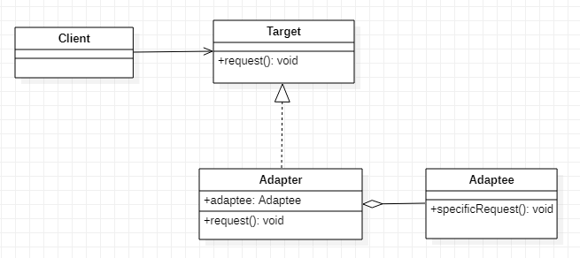

## 어댑터(Adapter)

1. 정의
   - 재사용하려는 클래스가 제공하는 인터페이스와 클라이언트가 사용하는 인터페이스가 다를 경우가 있는 데 어댑터 클래스를 이용하여 인터페이스를 일치시키는 패턴
2. 클래스 다이어그램
   
3. 구성요소
   - Target
     - 클라이언트에게 필요한 메서드(request())를 제공한다.
   - Client
     - Target에서 제공하는 메서드를 사용한다.
   - Adaptee
     - 클라이언트가 원하는 기능을 구현하는 메서드를 가지고 있다.
   - Adapter
     - Adaptee가 제공하는 메서드를 사용하고 Target 인터페이스를 구현한다.
4. 사용시점
   - 다른 개발자가 작성한 클래스를 재사용해야 한다.
   - 클라이언트가 요구하는 인터페이스와 재사용하려는 클래스의 인터페이스가 일치하지 않는다.
   - 애플리케이션에 필요한 기능을 이미 구현한 기존의 클래스가 있는데 수정이 불가능하거나 수정을 하였을 경우에 버그가 바라생할 가능성이 높다.
5. 사용효과
   - 인터페이스가 호환되지 않아 쓸 수 없었던 클래스들을 사용할 수 있게 해 준다.
   - 기존 클래스가 제공하는 기능의 안전성을 그대로 유지할 수 있다.
