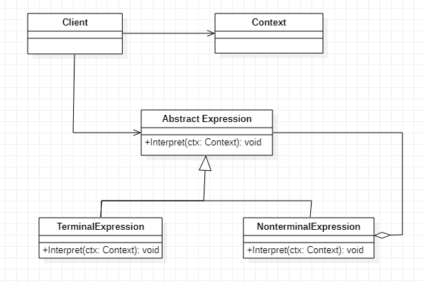
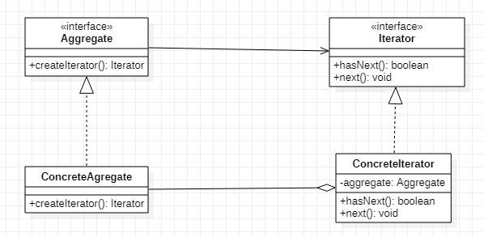
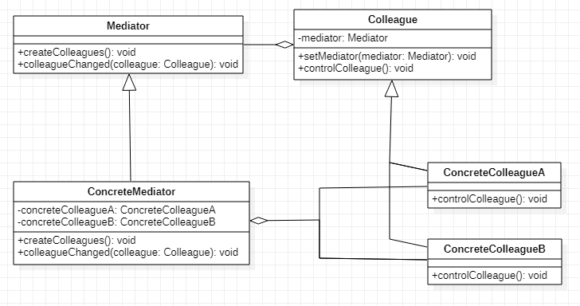
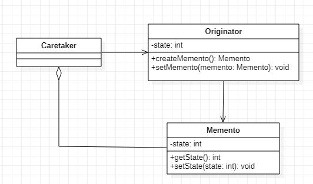
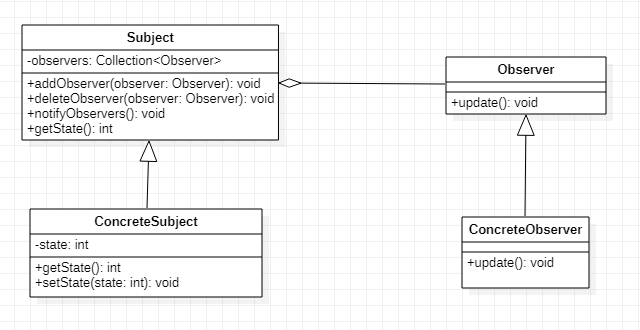
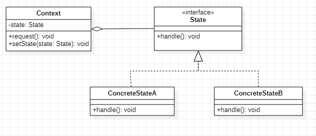
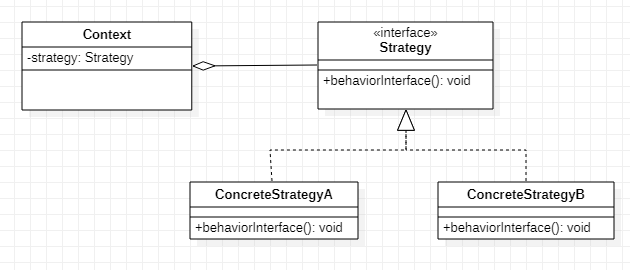

## 책임 연쇄(Chain of Responsibillity)

1. 정의
   - 다양한 처리 방식을 서로 연결하여 사슬로 만들고 요청이 들어오면 사슬을 통해 요청을 처리하는 패턴
2. 클래스 다이어그램
   - 
3. 구성요소
   - Handler
     - 요청을 처리하는 인터페이스를 선언한다.
   - ConcreteHandler
     - 요청을 처리하는 기능을 구현한다.
   - Client
     - 최초의 ConcreteHandler에게 요청을 한다.
4. 사용시점
   - 하나의 요청에 대해서 다양한 처리방식이 있다.
   - 요청을 처리하는데 따로 정해진 순서가 없다.
   - 요청을 보내는 객체에서 요청을 처리해야할 객체를 명확히 알기 어려운 경우
5. 사용효과
   - 요청을 하는 쪽과 이 요청을 처리하는 쪽의 연관 관계를 제거함으로써 서로의 독립성을 보장할 수 있다.
   - 요청을 보내는 역할을 하는 클래스와 요청을 받아서 처리하는 역할을 하는 클래스를 분리시킬 수 있다.
   - 사슬에 들어가는 객체를 추가/제거하거나 순서를 바꿈으로써 역할을 동적으로 변경할 수 있다.
   - 요청의 처리가 하나의 클래스에 집중되지 않고 여러 클래스로 나뉘어져 있으므로 각각의 클래스는 본인의 업무에 집중할 수 있고 확장이 쉽게 된다.

## 커맨드(Command)

1. 정의
   - 객체의 행동을 변화시키는 요구나 명령을 클래스로 표현하는 패턴
2. 클래스 다이어그램
   - 
3. 구성요소
   - Command
     - 객체의 행동을 제어하기 위한 명령을 위한 인터페이스를 선언한다.
     - execute()라는 단 하나의 메서드를 선언한다.
     - 되돌리기(undo)와 재실행하기(redo) 명령들을 지원해야 하는 경우도 있다.
   - ConcreteCommand
     - Command의 인터페이스를 실제로 구현한다.
     - 수신자(Receiver)를 필요로 한다.
   - Receiver
     - 명령을 받아들이는 객체이다.
     - 요구 사항을 수행하기 위해 어떤 일을 처리해야 하는지 알고 있는 객체이다.
   - Client
     - ConcreteCommand를 생성하고 Receiver를 설정한다.
     - Command 객체를 초기화한다.
   - Invoker
     - 실행할 명령을 가지고 있다.
     - Command의 execute() 메서드를 호출함으로써 Command 객체에게 특정 작업을 수행해 달라는 요구를 한다.
4. 사용시점
   - 객체의 다양한 행동이 존재한다.
   - 실행을 취소하거나 재실행 하는 기능이 있다.
   - 명령을 내리는 시점과 실제 명령을 수행하는 시점이 다른 경우가 있다.
5. 사용효과
   - 객체의 행동을 별도의 클래스에 캡슐화해서 행동 객체에 확장성을 부여한다.
   - 각각의 커맨드들은 특정 객체에 의존하지 않도록 만들어지므로 재활용성이 높다.
   - 어떤 작업을 요청한 쪽하고 그 작업을 처리한 쪽을 분리시킬 수 있다.
6. 사용예
   - 스케줄러, 스레드 풀, 작업 큐
   - 프로그램의 undo/ redo 기능

## 인터프리터(Interpreter)

1. 정의
   - 사용자가 명령을 내릴 수 있게 문법 규칙을 정의하고 전달된 문장을 번역하는 인터프리터를 클래스로 만들어 제공하는 패턴
2. 클래스 다이어그램
   - 
3. 구성요소
   - AbstractExpression
     - 구문 트리의 노드에 공통의 인터페이스를 선언한다.
   - TerminalExpression
     - BNF의 터미널 익스프레션에 대응한다.
   - NonterminalExpression
     - BNF의 논터미널 익스프레션에 대응한다.
   - Context
     - 인터프리터가 구문해석을 수행하도록 정보를 제공한다.
   - Client(의뢰자)
     - 구문 트리를 조립하기 위해 TerminalExpression이 NonterminalExpression을 호출한다.
4. 사용시점
   - 문법규칙을 가진 언어가 존재하고 그 언어를 번역(해석)할 인터프리터가 필요하다.
5. 사용효과
   - 문법 규칙을 가진 언어를 쉽게 구현할 수 있다.
   - 문법이 클래스에 의해 표현되기 때문에 언어를 쉽게 변경하거나 확장할 수 있다.
   - 사용자가 다양한 명령을 쉬운 표현 방법으로 전달할 수 있다.
6. 사용예
   - 스크립트 언어 및 프로그래밍 언어
   - DB SQL Query문
   - Command창에서 프로그램 실행 시 필요한 인자를 전달하는 경우

## 이터레이터(Iterator)

1. 정의
   - 집합체 내부 구조에 대한 노출을 피하면서 집합체에 들어 있는 모든 요소들에 접근할 수 있는 방법을 제공하는 패턴
2. 클래스 다이어그램
   - 
3. 구성요소
   - Iterator
     - 집합체 요소를 차례로 접근하는 인터페이스를 제공한다.
     - 다음 요소가 존재하는 지를 알기 위한 hasNext 메서드를 제공한다.
     - 다음 요소를 얻기 위한 next 메서드를 제공한다.
     - 집합체를 구성하는 역할은 포함되어서는 안된다.
   - ConcreteIterator
     - Iterator 인터페이스를 구현한다.
     - 반복작업에 필요한 집합체의 정보를 가지고 있다.
     - 반복작업 중에 현재 위치(커서)를 관리하는 일을 맡고 있다.
     - 다양한 형태의 이터레이터(역방향, 정방향)를 정의할 수 있다.
   - Aggregate
     - Iterator를 생성하는 인터페이스를 제공한다.
     - Iterator를 생성해서 돌려주는 createIterator 메서드를 제공한다.
   - ConcreteAggregate
     - Aggregate 인터페이스를 구현한다.
     - ConcreteIterator 객체를 생성한다.
4. 사용시점
   - 여러개의 요소로 이루어진 집합체가 있다.
   - 집합체의 각 요소를 나열(열거)하면서 접근하는 코드가 자주 반복된다.
   - 집합체의 내부 구조가 변경될 가능성이 있다.(예: 배열에서 리스트로 변경)
5. 사용효과
   - 집합체의 내부 구조에 대한 직접적인 노출을 막아 집합체의 안전성을 유지할 수 있다.
   - 집합체의 내부 구조가 변경(예: 리스트에서 배열로 변경)되더라도 구성 객체에게 동일한 방법으로 접근할 수 있다.
   - 집합체가 객체들의 집합을 구성하는 작업과 각 객체들을 열거하는 작업이 분리되어 있다.
6. 사용예
   - 자바 Colleciton 클래스에서 iterator() 메서드 제공

## 미디에이터(Mediator)

1. 정의
   여러 객체들이 서로 상호작용하면서 영향을 미칠 때 중개역할을 하는 객체를 중간에 두어 복잡한 통신을 한곳에서 집중해서 제어하도록 하는 패턴
2. 클래스 다이어그램
   - 
3. 구성요소
   - Mediator
     - 여러 Colleague들과 상호통신을 해서 조정을 하기 위한 인터페이스를 선언한다.
     - 통신할 Colleague들과 연결하는 메서드createColleagues()를 선언한다.
     - Colleague들이 조정을 위해 호출하는 메서드 colleagueChanged()를 선언한다.
   - ConcreteMediator
     - Mediator 인터페이스를 구현하여 여러 Colleague들과 상호통신으로 발생하는 문제들을 조정하는 기능을 한다.
   - Colleague
     - Mediator와 통신을 하기 위해 필요한 인터페이스를 선언한다.
     - 통신할 Mediator를 연결하는 setter 메서드를 선언한다.
   - ConcreteColleague
     - Colleague 인터페이스를 구현한다.
4. 사용시점
   - 객체들 간의 관계가 서로의 상호작용으로 복잡하다.
   - 다수의 객체가 다수의 객체와 통신한다. N:N 통신
   - 한 객체의 변경이 일어나면 자신과 그와 연관된 객체들이 양방향으로 서로 영향을 줄 때
5. 사용효과
   - 상호작용하는 객체들의 제어 로직을 한 군데 모아놨기 때문에 관리하기가 수월하다.
   - 객체 간에 오가는 메세지의 종류를 줄이고 단순화시킨다.
   - 복잡한 상호작용을 하는 복잡한 관계를 단순화시킬 수 있다.
6. 사용예
   - 서로 연관된 GUI 구성요소들을 관리하기 위한 용도로 많이 쓰임

## 메멘토(Memento)

1. 정의
   - 객체의 내부를 노출하지 않으면서 객체의 상태를 저장하여 필요할 때 객체 상태를 복원할 수 있는 패턴
2. 클래스 다이어그램
   - 
3. 구성요소
   - Originator
     - 자신의 현재 상태를 나타내는 Memento 객체를 생성한다.
     - Memento 객체는 특정 시점의 Originator 객체 상태의 스냅샷이다.
     - Caretaker가 Memento 객체를 요청하는 메서드(createMemento())를 선언한다.
     - Caretaker로 부터 이전의 Memento를 넘겨 받아 그 Memento를 만든 시점의 상태로 되돌려주는 메서드(setMemento())를 선언한다.
   - Memento
     - Originator의 내부 상태정보를 가지고 있다.
     - Memento는 Originator의 상태를 저장하고 Memento는 Originator가 유지하는 상태의 타입을 알아야 하기 때문에 서로 강하게 결합되어 있다.
   - Caretaker
     - Originator의 상태를 보존하기 위해 Memento를 Originator로 부터 넘겨 받아 보관해둔다.
4. 사용시점
   - 한 객체의 상태를 보존할 필요가 있다.
   - Undo/redo 기능이 필요하다.
   - 실행 취소 기능을 지원하고자 한다.
5. 사용효과
   - 저장된 상태를 핵심 객체와는 다른 별도의 객채에 보관하기 때문에 안전하다.
   - 핵심 객체의 데이터를 계속해서 캡슐화된 상태로 유지할 수 있다.
   - 복구 기능을 구현하기가 쉽다.
6. 사용예
   - 롤 플레잉 게임의 세이브 기능(캐릭터가 죽었을 때 전에 저장해 뒀던 곳에서부터 다시 시작할 수 있도록 한 기능)
   - 프로그램의 최신 작업 환경 - 프로그램 종료 후 시작할 때 최신 작업 환경으로 세팅
   - 트랜잭션 처리 중에 오류 발생시 롤백 처리할 때 유용하다.
   - 텍스트 에디터를 사용하고 있을 때 필요한 텍스트를 실수로 삭제해도 undo라는 기능을 사용하면 삭제하기 전의 상태로 텍스트를 복원할 수 있다.

## 옵저버(Observer)

1. 정의
   - 한 객체의 상태가 변하면 그 상태에 의존하는 여러 객체들에게 상태의 변화를 알려주는 패턴
2. 클래스 다이어그램
   - 
3. 구성요소
   - Subject
     - 감시 대상이 되는 상태를 가지고 있다.
     - Observer 목록을 인스턴스 변수로 가지고 있다.
     - Observer를 등록하는 메서드(addObserver())를 선언한다.
     - Observer를 삭제하는 메서드(deleteObserver())를 선언한다.
     - 현재의 상태를 취득할 수 있는 메서드 (getState())를 선언한다.
     - 상태의 변경이 발생하면 등록된 Observer들에게 변경된 내용을 알려주는 메서드(notifyObservers())를 선언한다.
   - ConcreteSubject
     - Subject 인터페이스를 구현한다.
   - Observer
     - Subject로 부터 상태 변화를 통보받는다.
     - Subject의 상태가 변경되었을 때 호출되는 메서드(update())를 선언한다.
   - ConcreteObserver
     - Observer 인터페이스를 구현한다.
4. 사용시점
   - 한 객체의 상태가 변경되면 그 객체와 연관된 여러 객체에도 변경이 요구된다.
   - 한 객체와 연관된 다수의 객체가 통신한다. (일대다 통신)
   - 객체의 상태가 변경되었다는 메시지는 단방향으로 흐른다.
   - 변화를 감지하는 클래스의 종류가 유동적이다.
5. 사용효과
   - 상태가 바뀌는 특정 객체와 상태 변화를 반영해야 하는 객체 사이의 결합도를 약하게 만들어준다.
   - 상태 변화를 반영하는 객체를 언제든지 추가하거나 삭제할 수 있다.
6. 사용예
   - redux: https://medium.com/@shlee1353/%EB%A6%AC%EC%95%A1%ED%8A%B8-%EB%A6%AC%EB%8D%95%EC%8A%A4-redux-%EC%99%80-observer-%ED%8C%A8%ED%84%B4-a4aae3468a25

## 스테이트(State)

1. 정의
   - 상태에 의존적인 객체를 상태관점에서 따로 분리하여 객체의 행동을 다루는 패턴
2. 클래스 다이어그램
   - 
3. 구성요소
   - State
     - 모든 상태에 사용되는 공통 인터페이스를 선언한다.
     - 이들 인터페이스는 각 상태에 따라 다른 행동을 하도록 하위 클래스에서 구현이 된다.
   - ConcreteState
     - State 인터페이스를 구체적으로 구현한다.
   - Context
     - Context 내부 상태를 나타내는 인스턴스 변수(state)를 가지고 있다.
     - request() 메서드가 호출되면 실제 기능을 본인이 수행하는 대신 내부 상태 객체에게 기능 수행을 위임한다.
     - 각 상태 클래스에서 상태 변경을 요청해 상태를 바꿀 수 있도록 하는 메서드(setState)가 제공된다.
4. 사용시점
   - 객체의 행동에 영향을 미치는 객체의 속성 '상태'가 존재한다.
   - 상태값을 저장하기 위한 인스턴스 변수를 만들고, 메서드 내에서는 조건문을 써서 다양한 상태를 처리한다.
   - 프로그래밍하다 보면 개체의 상태에 따라 구체적인 행위를 다르게 작성해야 하는 경우가 있다.
   - 상태에 따라 동일한 기능 요청의 처리를 다르게 함
   - 함수 안에 case나 if-else가 중복될 때
5. 사용효과
   - 각 상태의 행동을 별개의 클래스로 국지화 - 코드를 수정하거나 이해하기가 쉬워짐
   - 관리하기 힘든 골칫덩어리 if 선언문들을 없앰
   - 특정 형식의 상태 추가나 삭제를 빠르고 유연하게 대처할 수 있게 됩니다.
   - 새로운 상태가 추가되더라도 컨텍스트 코드가 받는 영향은 최소화된다.
   - 상태에 따른 동작을 구현한 코드가 각 상태 별로 구분되기 때문에 상태별 동작을 수정하기 쉽다.
6. 사용예
   - ECount Report에서 resizable, moveable, editable 상태에 따라 다르게 처리

## 스트래티지(Strategy)

1. 정의
   - 알고리즘을 클래스화해서 객체의 행동을 쉽게 변경할 수 있는 패턴
2. 클래스 다이어그램
   - 
3. 구성요소
   - Strategy
     - Strategy 인터페이스를 정의한다.
   - ConcreteStrategy
     - Strategy의 인터페이스를 실제로 구현한다.
     - 객체의 행동을 제어하는 구체적인 전략(알고리즘)을 코딩한다.
   - Context
     - ConcreteStrategy의 인스턴스를 가지고 있다.
     - Strategy 인터페이스를 이용하여 기능을 수행한다.
     - 실시간으로 구체적인 전략을 바꿀 수 있도록 setter 메서드를 제공한다.
4. 사용시점
   - 실시간으로 객체의 행동을 변경해야 할 필요가 있다.
   - 유사한 기능들이 복잡한 if-else 조건문에 분포되어 있다.
5. 사용효과
   - 전략의 수정과 추가에 따른 클라이언트의 의존성을 제거하여 전략을 쉽게 변경할 수 있다.
   - 실시간으로 전략을 선택하여 객체의 행동을 변경할 수 있다.
6. 사용예
   - 포토샵에서 작업한 이미지를 여러 포맷(jpg, gif, png)로 저장할 수 있다.
   - 게임 캐릭터의 공격무기를 다양하게 선택할 수 있다.

- State 패턴은 상태를 가지는 객체가 내부적으로 상태에 따라 로직을 분리해서 사용한다.
- Strategy 패턴은 클라이언트가 객체의 행위(전략)를 변경할 수 있다.
