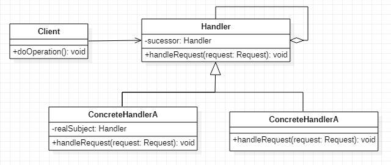
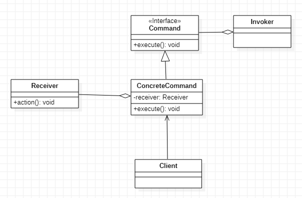

## 책임 연쇄(Chain of Responsibillity)

1. 정의
   - 다양한 처리 방식을 서로 연결하여 사슬로 만들고 요청이 들어오면 사슬을 통해 요청을 처리하는 패턴
2. 클래스 다이어그램
   - 
3. 구성요소
   - Handler
     - 요청을 처리하는 인터페이스를 선언한다.
   - ConcreteHandler
     - 요청을 처리하는 기능을 구현한다.
   - Client
     - 최초의 ConcreteHandler에게 요청을 한다.
4. 사용시점
   - 하나의 요청에 대해서 다양한 처리방식이 있다.
   - 요청을 처리하는데 따로 정해진 순서가 없다.
   - 요청을 보내는 객체에서 요청을 처리해야할 객체를 명확히 알기 어려운 경우
5. 사용효과
   - 요청을 하는 쪽과 이 요청을 처리하는 쪽의 연관 관계를 제거함으로써 서로의 독립성을 보장할 수 있다.
   - 요청을 보내는 역할을 하는 클래스와 요청을 받아서 처리하는 역할을 하는 클래스를 분리시킬 수 있다.
   - 사슬에 들어가는 객체를 추가/제거하거나 순서를 바꿈으로써 역할을 동적으로 변경할 수 있다.
   - 요청의 처리가 하나의 클래스에 집중되지 않고 여러 클래스로 나뉘어져 있으므로 각각의 클래스는 본인의 업무에 집중할 수 있고 확장이 쉽게 된다.

## 커맨드(Command)

1. 정의
   - 객체의 행동을 변화시키는 요구나 명령을 클래스로 표현하는 패턴
2. 클래스 다이어그램
   - 
3. 구성요소
   - Command
     - 객체의 행동을 제어하기 위한 명령을 위한 인터페이스를 선언한다.
     - execute()라는 단 하나의 메서드를 선언한다.
     - 되돌리기(undo)와 재실행하기(redo) 명령들을 지원해야 하는 경우도 있다.
   - ConcreteCommand
     - Command의 인터페이스를 실제로 구현한다.
     - 수신자(Receiver)를 필요로 한다.
   - Receiver
     - 명령을 받아들이는 객체이다.
     - 요구 사항을 수행하기 위해 어떤 일을 처리해야 하는지 알고 있는 객체이다.
   - Client
     - ConcreteCommand를 생성하고 Receiver를 설정한다.
     - Command 객체를 초기화한다.
   - Invoker
     - 실행할 명령을 가지고 있다.
     - Command의 execute() 메서드를 호출함으로써 Command 객체에게 특정 작업을 수행해 달라는 요구를 한다.
4. 사용시점
   - 객체의 다양한 행동이 존재한다.
   - 실행을 취소하거나 재실행 하는 기능이 있다.
   - 명령을 내리는 시점과 실제 명령을 수행하는 시점이 다른 경우가 있다.
5. 사용효과
   - 객체의 행동을 별도의 클래스에 캡슐화해서 행동 객체에 확장성을 부여한다.
   - 각각의 커맨드들은 특정 객체에 의존하지 않도록 만들어지므로 재활용성이 높다.
   - 어떤 작업을 요청한 쪽하고 그 작업을 처리한 쪽을 분리시킬 수 있다.
6. 사용예
   - 스케줄러, 스레드 풀, 작업 큐
   - 프로그램의 undo/ redo 기능
