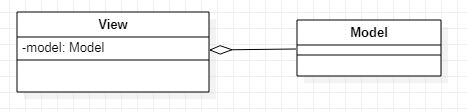
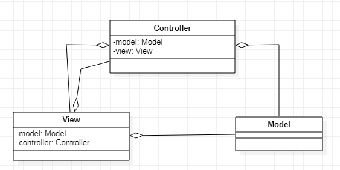
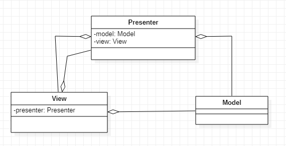

## 모델-뷰 (Model-View)

1. 정의
   - 모델과 뷰로 이루어진 패턴이다.
2. 클래스 다이어그램
   - 
3. 구성요소
   - Model
     - 애플리케이션에서 사용되는 데이터와 그 데이터를 처리한다.
   - View
     - 사용자에게 보여지는 UI 부분이다.
     - 화면에 Model이 가진 데이터를 보여주는 역할을 한다.
4. 특징
   - 입력받은 데이터를 뷰에서 직접 처리한다.
5. 장점
   - 단순해서 로직 처리를 직관적으로 할 수 있다.
6. 단점

   - 복잡한 로직 처리를 해야 하는 애플리케이션에는 적합하지 않다.

## 모델-뷰-컨트롤러 (Model-View-Controller)

1. 정의
   - MVC 패턴은 Model + View + Controller를 합친 용어이다.
2. 클래스 다이어그램
   - 
3. 구성요소
   - Model
     - 애플리케이션에서 사용되는 데이터와 그 데이터를 처리한다.
   - View
     - 사용자에게 보여지는 UI 부분이다.
     - 화면에 Model이 가진 데이터를 보여주는 역할을 한다.
   - Controller
     - 사용자의 입력을 받고 처리하는 부분이다.
4. 동작
   1. 사용자의 Action들은 Controller에 들어오게 된다.
   2. Controller는 사용자의 Action을 확인하고 Model을 업데이트한다.
   3. Controller는 Model을 나타내줄 View를 선택한다.
   4. View는 Model을 이용하여 화면을 나타낸다.
5. 특징
   - **_Controller는 여러개의 View를 선택할 수 있는 1:n 구조이다._**
6. 장점
   - 보편적으로 많이 사용되는 패턴이고 단순하다.
7. 단점
   - View와 Model 사이의 의존성이 높다.
   - View와 Model의 높은 의존성은 애플리케이션이 커질 수록 복잡하고 유지보수하기 어렵게 만들 수 있다.

## 모델-뷰-프레젠터 (Model-View-Presenter)

1. 정의
   - MVP 패턴은 Model + View + Presenter를 합친 용어이다. Model과 View는 MVC 패턴과 동일하고, Controller 대신 Presenter가 존재한다.
2. 클래스 다이어그램
   - 
3. 구성요소
   - Model
     - 애플리케이션에서 사용되는 데이터와 그 데이터를 처리한다.
   - View
     - 사용자에게 보여지는 UI 부분이다.
     - 화면에 Model이 가진 데이터를 보여주는 역할을 한다
   - Presenter
     - View에서 요청한 정보로 Model을 가공하여 View에 전달해 준다.
4. 동작
   - 사용자의 Action들은 View를 통해 들어오게 된다.
   - View는 데이터를 Presenter에 요청한다.
   - Presenter는 Model에게 데이터를 요청한다.
   - Model은 Presenter에게 요청받은 데이터를 응답한다.
   - Presenter는 View에게 데이터를 응답한다.
   - View는 Presenter가 응답한 데이터를 이용하여 화면을 나타낸다.
5. 특징
   - Presenter는 View와 Model의 인스턴스를 가지고 있어 둘을 연결하는 접착제 역할을 한다.
   - **_Presenter와 View는 1:1 관계이다._**
6. 장점
   - Presenter를 통해서만 데이터를 전달 받기 때문에 View와 Model의 의존성이 없다.
7. 단점
   - View와 Presenter 사이의 의존성이 높다.
   - 애플리케이션이 복잡해질수록 View와 Presenter 사이의 의존성이 강해진다.
